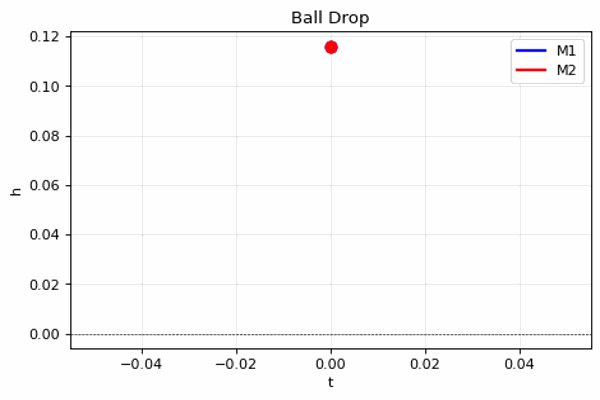
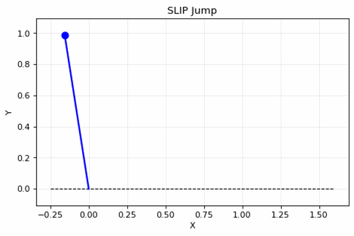

# Spring Dynamics

Two spring-mass dynamics simulations: ball drop and SLIP jump.

## Stack

Ball drop: scipy, numpy, pandas, matplotlib  
SLIP jump: scipy, numpy, matplotlib  
GIF: imageio, PIL

## Ball Drop

Spring-mass system with two masses. Free fall, compression, rebound phases.  
Params: m1=1.052, m2=0.060, k=9300, L0=0.03

**Animation:**


## SLIP Jump

Spring-loaded inverted pendulum. Stance and flight phases.  
Params: m=1, k=60, r0=1

**Animation:**


## Run

```bash
python ball_drop.py
python slip_jump.py
python create_gifs.py
```

